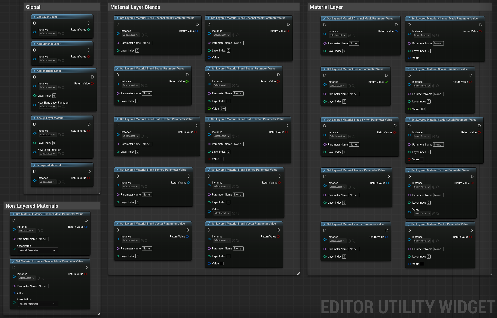
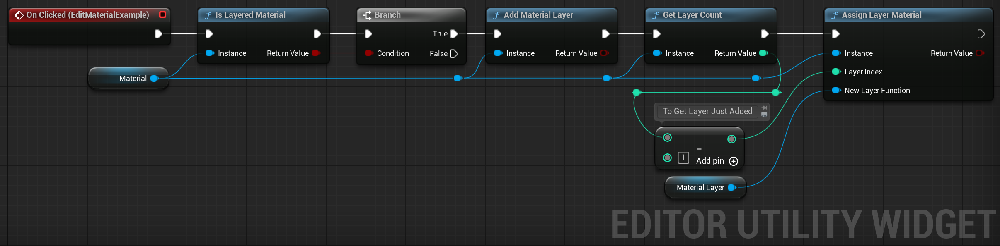

<!-- omit in toc -->
# UE Advanced Material Editing Library

[](https://opensource.org/licenses/MIT)
[](https://github.com/edwardmakesthings/UEAdvancedMaterialEditingLibrary/releases)
[](https://www.unrealengine.com/)

A Unreal Engine 5 plugin that provides functionality to edit material layer and material blend layer parameters through both Python and Blueprints.

<!-- omit in toc -->
## Compatibility

Builds/binaries are provided in the [releases](https://github.com/edwardmakesthings/UEAdvancedMaterialEditingLibrary/releases) page for UE5.1 to UE5.5.

Note: All versions of this plugin use the same source files.

<!-- omit in toc -->
## Table of Contents
- [Documentation](#documentation)
- [Features](#features)
- [Installation](#installation)
- [Usage](#usage)
  - [Blueprints Library](#blueprints-library)
  - [Blueprint Example](#blueprint-example)
  - [Python Library](#python-library)
  - [Simple(ish) Python Example](#simpleish-python-example)
- [Prerequisites](#prerequisites)
- [License](#license)
- [Contributing](#contributing)
- [Getting Help](#getting-help)

## Documentation
<!-- omit in index.md -->
📚 **[Documentation](https://edwardmakesthings.github.io/UEAdvancedMaterialEditingLibrary)**

View our (to be) comprehensive documentation including:

- [API Reference](https://edwardmakesthings.github.io/UEAdvancedMaterialEditingLibrary/reference/core/exceptions) - Comprehensive documentation for Python API
- [Git Guide for Beginners](https://edwardmakesthings.github.io/Node-Weaver/git-guide) - Version control basics explained simply (different project)

<!-- omit in index.md -->
<!-- omit in toc -->
## For Contributors
<!-- omit in index.md -->
💻 [Source Documentation](docs) - Documentation source files for development (can find locally)

## Features

- Get and set parameters for material layers and blend layers
- Support for different parameter types:
  - Scalar parameters
  - Vector parameters
  - Texture parameters
  - Static switch parameters
  - Channel mask parameters
- Add and manage material layers programmatically
- Full Blueprint and Python support
- Built-in channel mask constants (Red, Green, Blue, Alpha)
- Type-safe parameter handling

## Installation

1. Download the compatible build for your UE version from the releases page
2. Copy the plugin to your project's `Plugins` folder
3. Restart Unreal Engine
4. Enable the plugin in Edit > Plugins > Materials

Or use the included `RebuildPlugin.bat` to auto-build the plugin for a new version of UE

## Usage

### Blueprints Library

The plugin provides the following Blueprint nodes for Editor Utility Widgets:



### Blueprint Example

This example would check if a material is layered, if it is, add a new material layer, get the count, and assign
a specific material layer asset to it.

Note: These blueprint nodes are ONLY available in Editor Utility Widgets because they adjust elements in-editor,
not in-game.



### Python Library

The plugin provides a convenient `LayeredMaterialLibrary` class with static methods for material manipulation. When
the plugin is added to your project, you can access it via:

`from layered_material_library import LayeredMaterialLibrary`

### Simple(ish) Python Example

The following example shows a way to approach using the python library that comes with the plugin.
While it only shows the process of getting and setting values on a Material Layer, it works almost
the exact same way for Material Layer Blend assets.

```python
from layered_material_library import LayeredMaterialLibrary
import unreal

# Load required assets
material_instance = unreal.load_object(None, '/AdvancedMaterialEditingLibrary/Examples/MI_TargetMaterial')
simple_layer = unreal.load_object(None, '/AdvancedMaterialEditingLibrary/Examples/ML_MaterialLayer')
red_layer = unreal.load_object(None, '/AdvancedMaterialEditingLibrary/Examples/ML_MaterialLayer_Red')
blend_function = unreal.load_object(None, '/AdvancedMaterialEditingLibrary/Examples/MLB_MaterialLayerBlend')

# Check material properties
print(f"Material instance is layered material: {LayeredMaterialLibrary.is_layered_material(material_instance)}")
print(f"Initial layer count: {LayeredMaterialLibrary.get_layer_count(material_instance)}")

# Add and configure layers
LayeredMaterialLibrary.assign_layer_material(material_instance, 0, red_layer) # Set base layer to a new material

LayeredMaterialLibrary.add_material_layer(material_instance)  # Add second layer
LayeredMaterialLibrary.assign_layer_material(material_instance, 1, simple_layer)
LayeredMaterialLibrary.assign_blend_layer(material_instance, 1, blend_function)

LayeredMaterialLibrary.add_material_layer(material_instance)  # Add third layer
LayeredMaterialLibrary.assign_layer_material(material_instance, 2, simple_layer)
LayeredMaterialLibrary.assign_blend_layer(material_instance, 2, blend_function)

# Modify layer parameters
# For all parameter names, they just need to match whatever label you set for them when you created
# the master material/material layer/material layer blend.
def modify_layer_parameters(layer_index: int, metallic: float = 0):
    """Example of a function that could modify parameters of different kinds.

    When a parameter is set, the checkbox to enable editing it is enabled, even if the value was not
    changed. I do a test below with the scalar value before setting to avoid enabling the parameter
    if it isn't necessary.

    Args:
        layer_index: The layer index to search for the parameter on
        metallic: Example argument for a value you could set on a scalar value.

    """
    # Scalar parameter example
    metallic_value = LayeredMaterialLibrary.get_layered_material_scalar_parameter_value(
        material_instance, 'Metallic', layer_index
    )
    if metallic_value != metallic:
        LayeredMaterialLibrary.set_layered_material_scalar_parameter_value(
            material_instance, 'Metallic', layer_index, metallic
        )

    # Static switch example
    LayeredMaterialLibrary.set_layered_material_static_switch_parameter_value(
        material_instance, 'Use Normal Map', layer_index, True
    )

    # Texture parameter example - Requires StarterContent
    texture = unreal.load_object(None, '/Game/StarterContent/Textures/T_CobbleStone_Rough_N')
    LayeredMaterialLibrary.set_layered_material_texture_parameter_value(
        material_instance, 'Normal Map', layer_index, texture
    )

# Modify parameters for the layers
modify_layer_parameters(layer_index=1, metallic=0)
modify_layer_parameters(layer_index=2, metallic=1)

# Verify changes
print(f"Final layer count: {LayeredMaterialLibrary.get_layer_count(material_instance)}")
print(f"Layer 1 Metallic value: {LayeredMaterialLibrary.get_layered_material_scalar_parameter_value(material_instance, 'Metallic', 1)}")
print(f"Layer 1 Normal Map enabled: {LayeredMaterialLibrary.get_layered_material_static_switch_parameter_value(material_instance, 'Use Normal Map', 1)}")
print(f"Layer 2 Metallic value: {LayeredMaterialLibrary.get_layered_material_scalar_parameter_value(material_instance, 'Metallic', 2)}")
print(f"Layer 2 Normal Map enabled: {LayeredMaterialLibrary.get_layered_material_static_switch_parameter_value(material_instance, 'Use Normal Map', 2)}")
```

If you copy-paste the above into an Unreal Engine terminal (Output Log set to Python is my preference)
you should get the following result when you view the material at `/AdvancedMaterialEditingLibrary/Examples/MI_TargetMaterial`


## Prerequisites

- Unreal Engine 5.1 or later

## License

This project is licensed under the MIT License - see the [LICENSE](LICENSE) file for details.

## Contributing

The project is small, I'm not sure it can expand much but feel free to contribute! If you're new to open source check out:

1. My [Git Guide](https://edwardmakesthings.github.io/Node-Weaver/git-guide) for version control basics
2. GitHub's guide on [Creating a Pull Request](https://docs.github.com/en/pull-requests/collaborating-with-pull-requests/proposing-changes-to-your-work-with-pull-requests/creating-a-pull-request)
3. The [issues page](https://github.com/edwardmakesthings/UEAdvancedMaterialEditingLibrary/issues) for beginner-friendly tasks

## Getting Help

- [Open an issue](https://github.com/edwardmakesthings/Node-Weaver/issues) for bugs or feature requests
- Check [troubleshooting](https://edwardmakesthings.github.io/UEAdvancedMaterialEditingLibrary/troubleshooting) for common issues
- Review existing issues before creating new ones
- Don't hesitate to ask questions - I'm here to help!